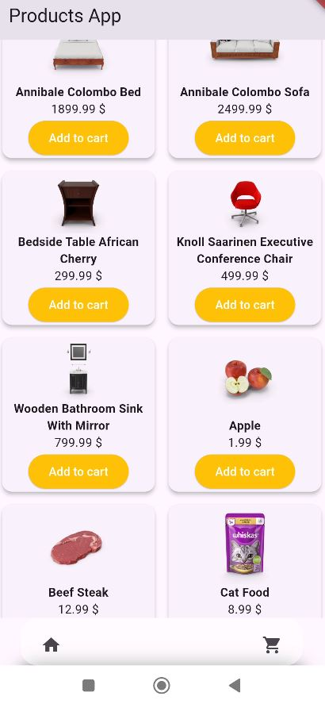
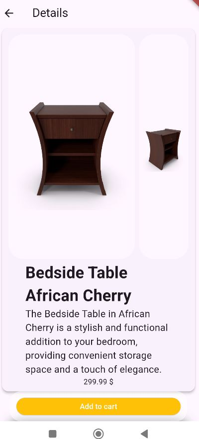
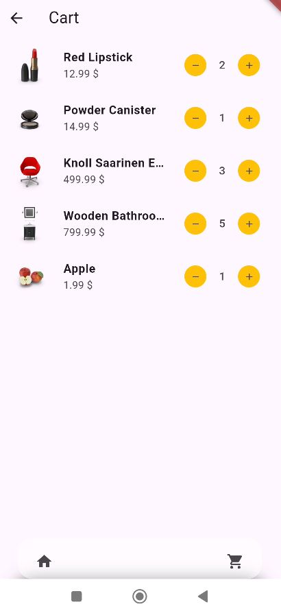

# product_test
Flutter app with three screens: ListProduct, CardProduct, CartProduct.

## Screenshots

### Products

### Details

### Cart

## technology stack
- dio
- get_it
- bloc
- sqlite
- go_router

## how to run
For development was used Android Studio.
Flutter SDK: 3.24.4
Dart SDK version: 3.5.4 (stable)
jdk version 17 
- optional: 
add to gradle.properties file in .android folder  
org.gradle.java.home={$path},
where path leads to jdk version 17

